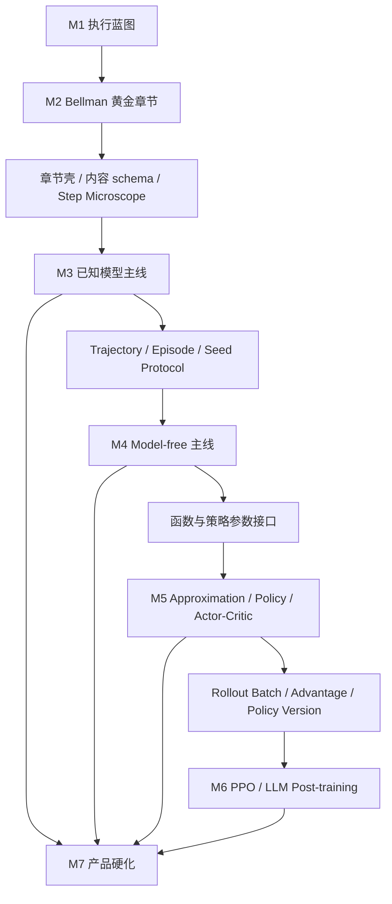

# RL Foundations Lab 实施路线图

- 文档版本：`v0.3`
- 日期：`2026-07-19`
- 状态：01–16 内容 Source Coverage 复审批次完成；06 为算法交互样板，专用实验硬化继续

## 1. 推进结论

项目不采用“先把所有页面做出来，再统一补内容”的方式，也不在蓝图阶段无限讨论。正式推进循环是：

```text
冻结一个章节的问题与来源
    → 完成内容 storyboard
    → 定义实验状态和数值基线
    → 实现一个纵向切片
    → 实际渲染与教学验收
    → 提炼可复用能力
    → 进入下一章节
```

当前页面已经形成从 MDP 到 Actor–Critic 的可运行骨架，但“页面存在”不等于“章节完成”。新一轮重构以 `CHAPTER_REBUILD_AUDIT.md` 为准：逐章恢复源材料的完整问题链、算法族、推导、伪代码和 worked example，再用专用交互增强，而不是用通用知识卡片或改名曲线代替。

## 2. 当前基线

### 已具备

- React/Vite 浏览器端原型和中英文切换。
- 01–05 完整学习地图、双语章节正文、课件页码和五个主交互画布。
- 课件一致的 5×5 continuing Grid World 数值引擎。
- Return 分解、精确/采样 state value 与固定 seed 运行协议。
- Bellman 与 Optimality 的单步更新、value table、策略箭头、公式代入、残差、undo/reset。
- VI、Truncated PI、PI 的公平 Planning Arena：累计 backups、policy updates、残差曲线和逐状态传播。
- Actor-Critic 结构桥梁和 PPO-Clip 样本平面。
- 语言模型 PPO 的共享 batch 算法/系统双视图。
- 无远端请求、无持久化存储的测试约束。

### 当前重构状态

- 06 Monte Carlo 已按新标准完成第一版：完整算法演化、伪代码、共享 Grid World episode、访问覆盖、Q 更新和策略分布同步。
- 01–05 已补齐审计中的手算、矩阵、contraction、完整算法例程与 worked example，并纳入统一连续正文组件。
- 07–13 已恢复关键理论、算法族、定理条件、完整伪代码和 worked example；现有通用参数实验仍需逐章升级为专用内部状态画布。
- 14 已补齐四种裁剪情况、完整 objective、GAE 与 minibatch 生命周期；15 Token MDP 已实现独立双语章节和逐 token 奖励实验；16 已补齐模型血缘、token reward、batch contract 与故障分析。

### M2 完成记录

- 已完成 Bellman Scene 0-9 storyboard，并精确映射 L2 PDF pp.18-53。
- 已建立章节内容 schema、双语结构校验和共享术语表。
- 已把 return 递归、条件期望、矩阵形式、持续型任务边界、action value 与来源接入页面。
- 已接入四个作者预设状态机、概率后继贡献展开、公式/画布焦点联动和四行 backup 伪代码同步。
- 已完成 discount-horizon 的 `γ=0.90 / γ=0.50` 同策略、同环境、同收敛阈值双基线对比。
- 已加入课件一位小数 fixed-policy value table 基准；最大复现误差为 `0.041`。
- 已完成桌面、390px 和 320px 渲染验收；320px 页面无横向溢出，移动导航改为 2×2 章节网格。
- 已完成 M2 退出条件审计；验收证据见 `M2_ACCEPTANCE.md`。
- 已冻结 Step Microscope 的共享 phase、step outcome、history、undo/reset 与 playback 边界；接口见 `STEP_MICROSCOPE_CONTRACT.md`。

## 3. 并行工作流

每个里程碑都按四条工作流验收，但同一时间只把一个章节设为主实施对象。

| 工作流 | 负责问题 | 主要交付物 |
|---|---|---|
| Product & Curriculum | 为什么教、先后关系、做到什么深度 | driving question、依赖图、章节合同、验收标准 |
| Content & Math | 讲什么、公式如何出现、来源在哪里 | 中英文内容、推导、图注、术语、课件/论文引用 |
| Experiment & Engine | 数据怎样产生、哪些结果可复现 | 环境契约、算法状态机、seed protocol、数值测试 |
| Interaction & QA | 学习者怎样操作、怎样判断已经理解 | 画布、联动、预设现象、响应式与可访问性检查 |

## 4. 里程碑

### M0：交互方向验证 - 已完成

目标：证明“阅读 + 可操作实验 + 经典到现代迁移”的产品方向可行。

完成证据：

- Bellman、Planning、PPO 和 System View 四类样张可以运行。
- 课件 Grid World 已替换通用墙体迷宫。
- 关键数值测试和生产构建通过。

### M1：执行蓝图冻结 - 本轮

目标：让后续工作有统一课程边界、来源映射和完成定义。

交付物：

- `PRODUCT_BLUEPRINT.md` 执行版；
- `CURRICULUM_MAP.md`；
- `EXECUTION_ROADMAP.md`；
- README 中的产品与实施入口。

退出条件：

- L1-L10 每一讲都有网站章节归属；
- 现代 PPO/语言模型章节与课件主线的接口明确；
- 黄金章节范围、Grid World 数据契约和章节完成定义明确；
- 当前原型与正式 v1 的差距被显式记录。

### M2：Bellman 黄金章节

目标：把当前 Bellman 样张做成可以独立学习、验证和复用的正式章节。

必做交付：

1. 章节 storyboard 与中英文内容稿；
2. return/value 前置回顾；
3. Bellman 推导与矩阵形式；
4. 精确 backup、连续 sweep 和边界自循环三个交互路径；
5. 公式、网格、value table 与伪代码双向联动；
6. 四个作者预设现象；
7. 课件一位小数 value 表回归测试；
8. 桌面与窄屏渲染验收。

退出条件：

- 满足 `CURRICULUM_MAP.md` 的黄金章节验收；
- 内容不依赖组件内硬编码；
- 通用章节壳和 Step Microscope 接口可以被下一章复用；
- 一位不查看源代码的读者可以解释一次 backup 的每一项和 continuing target 的含义。

### M3：经典已知模型主线 — 已完成

覆盖章节：01、02、04、05。

目标：补齐从 MDP 到最优规划的连续阅读路径，使黄金章节不再是孤立页面。

核心交付：

- Course World Explorer；
- Return Observatory 与精确/采样 value 切换；
- Optimality Switch，作为 Step Microscope 的第二个真实消费者；
- VI、PI、Truncated PI Planning Arena；
- 完整学习地图的 Part I，以及桌面与 390px 实机验收。

退出条件：

- L1-L4 的核心概念和例子全部有网站归属；
- fixed policy evaluation 与 optimal control 明确区分；
- Planning 比较至少同时展示 backup 数、policy changes 和逐状态传播，不由单一全局残差主导结论；
- 四章共用同一 Grid World 数据契约。

### M4：Model-free Learning 主线

覆盖章节：06-09。

目标：从“知道模型的精确 backup”平滑过渡到“只从经验样本学习”。

核心交付：

- trajectory/episode 数据模型；
- 固定 seed 和多 seed 运行协议；
- MC Episode Tape；
- Stochastic Approximation Curve Lab；
- MC/TD/n-step target comparator；
- Sarsa/Q-learning Control Arena 与 Cliff World 专题变体。

退出条件：

- 页面能清楚区分 exact expectation、single sample、single run 和 aggregate statistics；
- 所有随机实验可由 seed 复现；
- Sarsa/Q-learning 比较使用相同探索预算和配对随机条件；
- 主线程在批量运行期间保持可操作，必要时引入 Web Worker。

### M5：Function Approximation 与 Policy Methods

覆盖章节：10-13。

目标：完成从 value table 到参数化 value/policy，再到 Actor-Critic 的概念迁移。

核心交付：

- Feature Grid 与线性函数近似；
- DQN online/target/replay 系统实验；
- Policy Gradient Studio；
- Actor-Critic 双更新显微镜；
- advantage、baseline 和 importance sampling 的统一数据接口。

退出条件：

- 学习者能观察一次参数更新如何同时影响多个状态；
- DQN 的 replay 与 target network 分别产生可见证据；
- Policy Gradient 与 Actor-Critic 复用同一个策略分布和 trajectory 对象；
- Actor-Critic 输出可以直接成为 PPO 章节输入。

### M6：PPO 与语言模型后训练

覆盖章节：14-16。

目标：把 PPO 从静态公式样张升级为可推进的 rollout/update 实验，并完成算法到工程系统的迁移。

核心交付：

- rollout batch、old/new policy version、GAE 和 minibatch 状态机；
- PPO 多 epoch 更新与 clip/KL 演化；
- Token MDP Representation Morph；
- policy/reference/reward/value/rollout shared-batch System Map；
- 算法视图和系统视图的双向选择与证据追踪。

退出条件：

- ratio、advantage、clip、KL 和 loss 均来自同一批样本；
- 修改 clip、GAE、epochs 或 KL penalty 能改变可观察中间量；
- 一条 response 可以从 token logprob 追踪到 reward、advantage、ratio 和 update；
- 工程拓扑不使用与算法视图无关的装饰性数据。

### M7：完整 v1 硬化

目标：将已经完成的章节统一成可靠课程产品。

核心交付：

- 完整学习地图和章节导航；
- 中英文术语审校和内容一致性检查；
- 响应式、键盘操作、对比度和非颜色编码；
- 性能预算、错误边界和降级策略；
- 来源索引与公开链接检查；
- 全课程数值、交互和渲染回归。

退出条件：16 个章节均满足章节完成定义。

## 5. 依赖顺序



## 6. 近期实施队列

M1 完成后，严格按以下顺序进入代码与内容工作：

1. 编写 Bellman 黄金章节 storyboard，固定每一屏/段的教学任务。
2. 定义章节内容 schema：标题、前置、观察、机制、深入、预设、来源和双语字段。
3. 将当前 `content.js` 拆为内容数据和 UI 文案，建立术语表。
4. 把 Grid World 契约固化为环境配置，并增加课件 value 表 fixture。
5. 为 Step Microscope 定义 `before → sample/model expectation → target → after` 通用接口。
6. 补齐 Bellman 矩阵形式、伪代码联动和边界自循环预设。
7. 增加章节级窄屏布局和键盘交互。
8. 完成黄金章节教学审阅、数值测试和实际渲染检查。
9. 从黄金章节抽取通用章节壳，不提前抽象未被第二章复用的组件。
10. 进入章节 01 和 02，补齐 Bellman 的前置路径。

## 7. 技术演进边界

当前 Vite/React 结构足以继续黄金章节，不需要立即更换框架。只有出现真实需求时再引入：

- 路由：当正式章节超过当前四个样张并需要可链接章节 URL 时；
- MDX/结构化内容系统：在黄金章节 schema 确认后；
- Web Worker：在多 seed 或参数扫描阻塞主线程时；
- 图表库：当手写 SVG 无法稳定复用统计图语法时；
- 状态管理库：当同一实验跨多个深层组件共享状态且 React 局部状态无法清晰表达时；
- 后端：完整 v1 默认不需要，仅在真实模型推理或大规模计算成为明确范围后重新评估。

## 8. 风险与控制

| 风险 | 早期信号 | 控制方式 |
|---|---|---|
| 章节变成公式百科 | 页面先出现大量推导，实验只作插图 | 每章先冻结唯一主问题和必须观察的证据 |
| 交互很多但没有结论 | 参数很多，读者不知道看哪里 | 默认参数不超过四个，配作者预设和观察提示 |
| 为复用而过早抽象 | 通用组件充满章节特例 | 黄金章节完成后，再用第二个真实章节验证抽象 |
| 数值与文字分叉 | 公式、曲线和表格使用不同示例数据 | 单一实验状态和数值 fixture；禁止复制展示数值 |
| 随机结果被当成规律 | 单 seed 曲线直接支撑结论 | 明确单样本/单运行/多 seed，并显示波动范围 |
| 现代部分突然换术语 | 经典对象和 LLM 系统无中间桥梁 | 强制先完成 Token MDP Bridge，再进入 System Map |
| 课程范围失控 | 不断加入 DPO、GRPO、Agent RL | 完整 v1 截止 PPO-based LM post-training，其他进入扩展区 |

## 9. 每个里程碑的报告格式

完成一个里程碑时只报告以下内容：

1. 已完成的学习能力，而不是文件数量；
2. 可以现场复现的默认实验；
3. 数值、交互和渲染验证结果；
4. 尚未覆盖的边界；
5. 下一里程碑会复用的接口；
6. 是否触发了蓝图或课程地图变更。

## 10. 当前下一步

01–16 的内容 Source Coverage 复审批次已经落地。下一阶段进入 **M4–M7 交互与证据硬化**：先按依赖顺序把 07–13 的通用曲线替换为 noisy-root、TD transition、Cliff control、feature sharing、replay batch、trajectory contribution 与 dual-optimizer 专用画布；同时把 14–16 的 PPO epoch/KL 和共享 token batch 做成可逐轮推进的状态机。每完成一章再补数值 fixture、多 seed 协议和桌面/窄屏渲染证据。
