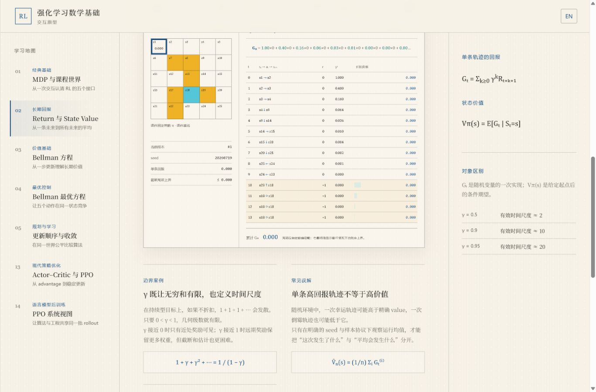
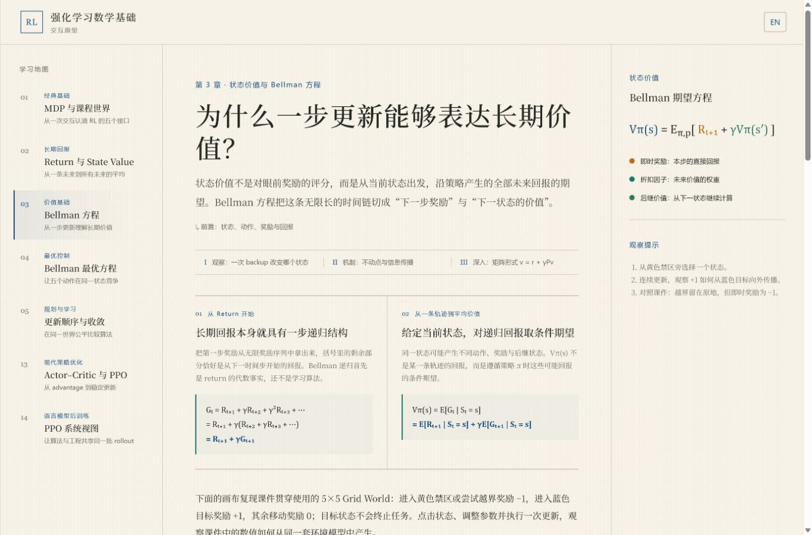

# 阅读框架与交互推导升级审计

- 日期：2026-07-19
- 范围：桌面阅读壳、左右侧栏、Return 画布、Bellman 正文与课件推导覆盖
- 用户目标：在保留教材完整性的前提下，让交互画布更清晰，并用交互帮助读者理解公式如何逐步得到
- 审计结论：现有视觉方向和章节骨架成立；下一阶段不应继续横向增加功能，而应先重构页面宽度分配，并建立可复用的交互推导语法。

## 1. 截图步骤与健康度

### Step 1 · 章节阅读入口 — 基础健康，空间分配需调整

- 优点：章节问题、前置知识、三层阅读深度和双语入口清楚；左侧学习地图提供了稳定的全局定位。
- 问题：当前桌面网格固定为 `276px + main + 326px`。在 1366px 视口中，两侧合计占用约 44%，正文和画布只能使用剩余空间。
- 右栏当前以静态公式、术语解释和观察提示为主，内容与正文重复，且不随滚动或画布选择变化，因此没有持续证明 326px 固定占用的价值。
- 可访问性风险：两侧说明大量使用 `.64–.78rem` 字号与低对比灰色；截图只能确认视觉风险，仍需键盘焦点、缩放和对比度实测。

### Step 2 · Return 交互画布 — 功能健康，可读性不健康

- 优点：环境、seed、轨迹、折扣权重和逐步贡献处在同一证据链中，教学对象完整。
- 问题：画布实际宽度约 652px，却同时承担 5×5 网格、样本读数和五列表格；表格正文 CSS 仅 `.52rem`，肉眼难以稳定读取。
- 这不是单纯“字号调大”能解决的问题。继续在 652px 内放大字体会导致换行和高度失控，根因仍是页面壳挤压画布。
- 可访问性风险：小字号、密集表格和颜色较淡的折扣贡献标记可能在 200% 缩放下失去结构，需要响应式重排而非整体缩放。

### Step 3 · Bellman 正文到画布 — 方向正确，推导链明显不完整

- 优点：网站已经展示 `G_t` 的三步递归与从 return 到条件期望的第一步，且公式颜色能与画布变量联动；这是后续交互推导的正确起点。
- 缺口：课件 L2 pp.21–24 继续逐步展开即时奖励项、后继价值项、策略概率、奖励分布、转移分布和 Markov 条件，网站目前从条件期望直接跳到画布，省略了中间四层推导理由。
- L3 的 `policy weighted expectation → max`、矩阵形式和最优策略论证，以及 L4 的 VI 两步分解、PI evaluation/improvement 链和 VI/PI 对照，也只保留了结论或短段落。
- 结果是画布能告诉读者“这个数怎么算”，却还不能完整回答“这个公式为什么可以这样改写”。

## 2. 建议的新页面宽度系统

不要把正文和画布使用同一个最大宽度。建议建立三种内容宽度：

| 层 | 推荐宽度 | 用途 |
|---|---:|---|
| Prose | 720–780px | 连续正文，保证舒适行长 |
| Derivation | 880–960px | 多步等式、理由注释和符号说明 |
| Lab | 1080–1240px | 网格、曲线、表格和控制器 |

页面框架建议：

- 左栏默认缩为 92–104px，只显示章节号、短标题与当前状态；点击或悬停后以浮层扩展到约 248px，扩展时不挤压正文。
- 右栏改为 48–56px 的折叠式“学习工作台”入口，只有在读者打开或当前内容需要时才占 260–300px。
- 主区优先获得宽度；正文仍保持窄行长，画布通过 breakout 容器扩到 Lab 宽度。
- 每个复杂画布增加“聚焦模式”，临时收起左右栏，但它是补充能力，不应替代正常桌面布局的可读性。

## 3. 右侧栏重新定义

右栏不再承担静态摘要，而改成随上下文变化的学习工作台：

1. 阅读正文时显示本章目录、当前位置和前置依赖。
2. 进入公式推导时显示当前等式所使用的定义、假设与符号表。
3. 操作画布时显示当前选择的状态、动作、概率、target、residual 与“这一步说明了什么”。
4. 点击正文或公式中的符号时，右栏定位到对应解释；点击解释时反向高亮正文和画布。

这样右栏的核心价值变成“解释当前正在看的对象”，而不是重复一遍本章结论。对于信息较少的章节，它应保持折叠。

## 4. 交互推导的统一语法

新增可复用的 `Derivation Explorer`，每条推导由以下对象组成：

- `expressionBefore`：改写前的式子；
- `transformation`：本步使用的定义、线性性质、全概率公式或 Markov 条件；
- `expressionAfter`：改写后的式子；
- `assumptions`：本步成立所需条件；
- `bindings`：公式符号与网格、轨迹、策略或算法状态的双向映射；
- `numericExample`：当前画布状态下的数值代入。

交互方式：

- 逐步前进、后退或展开全部推导；
- 点击一个求和符号，只显示被枚举的动作、奖励或后继状态；
- 在“符号形式 / 当前数值”之间切换；
- 每一步必须显示“为什么能这样变”，而不只是等号后的结果；
- 公式推进时同步高亮画布，画布参数变化时只更新数值层，不改变符号推导。

## 5. Part I 推导补全顺序

| 章 | 优先补全的推导链 |
|---|---|
| 01 | `p(s',r|s,a)` 的环境分解、策略与环境职责、Markov 条件为何足够 |
| 02 | 折扣和、几何级数、episodic/continuing 边界、随机 return 到条件期望 |
| 03 | `G_t` 递归 → 条件期望拆分 → 即时奖励项展开 → 后继价值项展开 → Markov 化简 → 标量与矩阵 Bellman 方程 |
| 04 | 策略加权是动作价值的凸组合 → 最大项上界 → 确定性 greedy 策略 → `T*`、不动点与压缩性 |
| 05 | BOE → VI 的 policy/value 两步；PI 的 evaluation/improvement；policy improvement 理由；VI/TPI/PI 的统一视角 |

优先从第 03 章做第二个“黄金切片”：它既有现成交互联动，又能覆盖课件中最典型的多步推导。完成后再把同一组件迁移到 02、04、05，避免五章分别发明不同的推导交互。

## 6. 证据与限制

- 产品截图均来自本轮运行中的 `http://127.0.0.1:5173/` 桌面页面。
- 课件对照已检查 L2 pp.21–24、L3 BOE elementwise/matrix 页面，以及 L4 的 VI、PI 和二者对照页面；对应渲染图与本报告放在同一目录。
- 本轮是结构与视觉审计，没有执行屏幕阅读器、完整键盘流、对比度计算或 200% 浏览器缩放，因此不声称完整 WCAG 合规。
