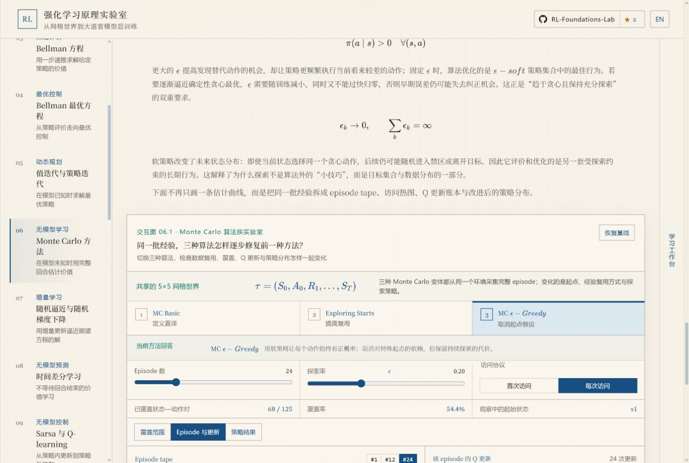
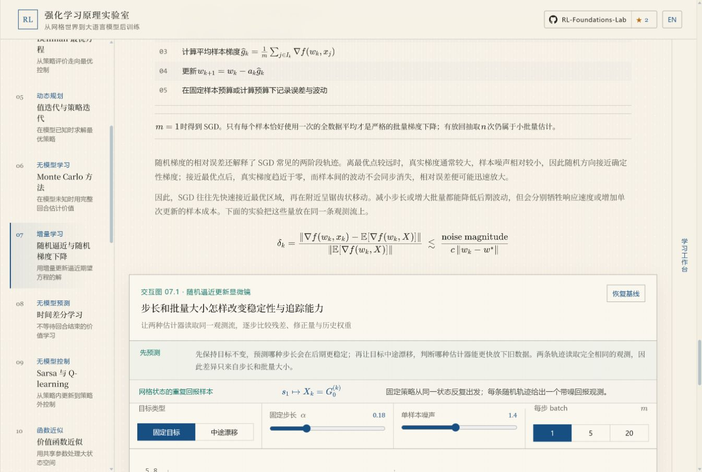
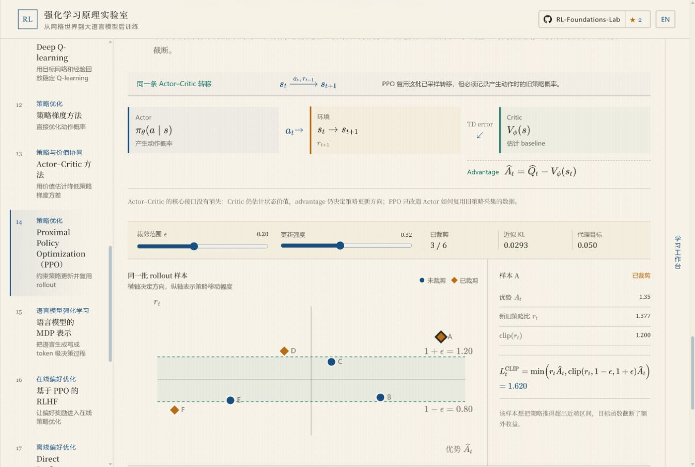
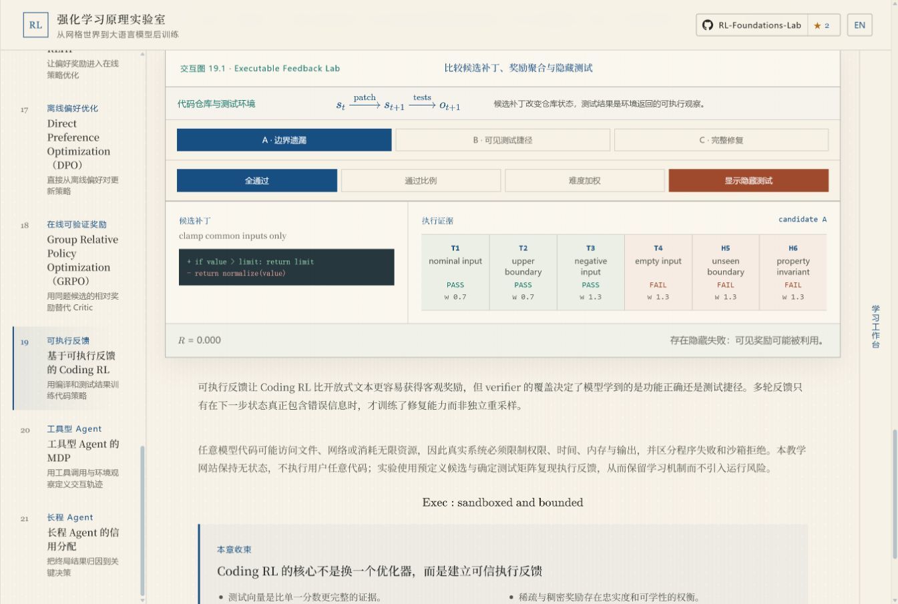
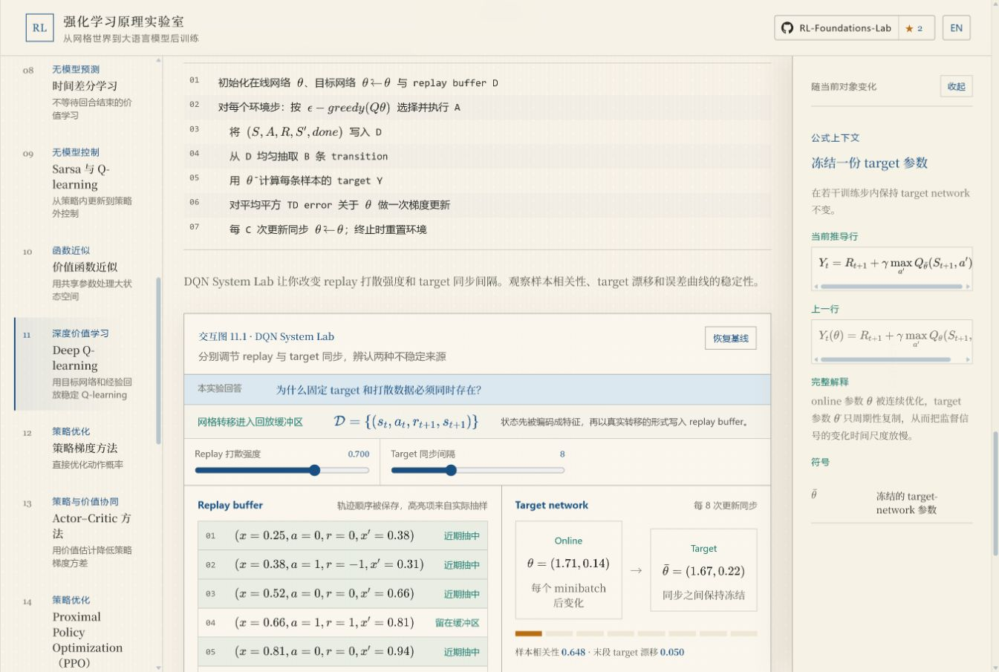
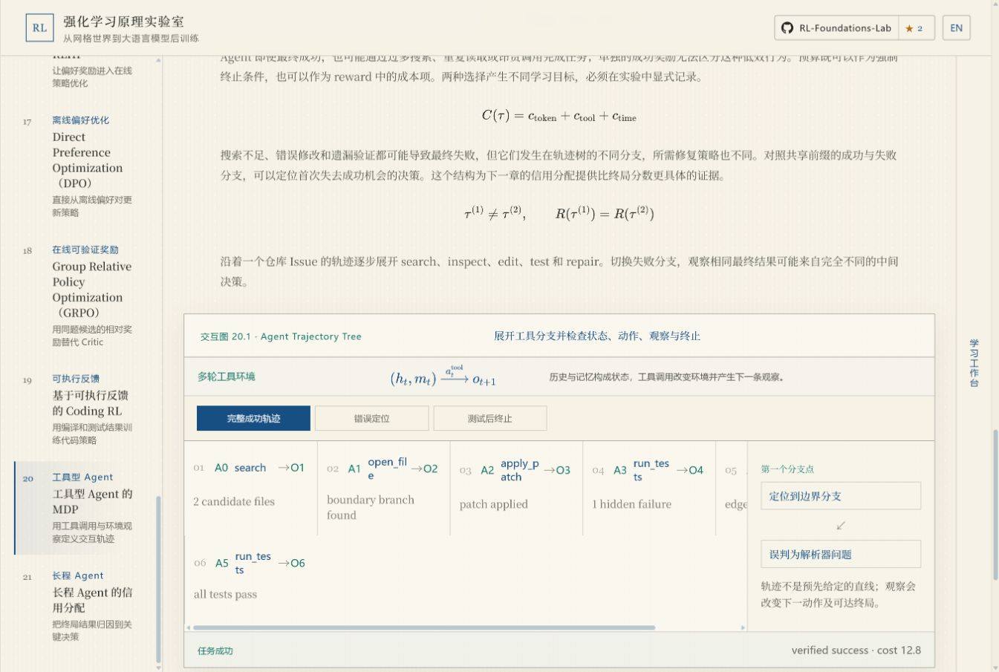
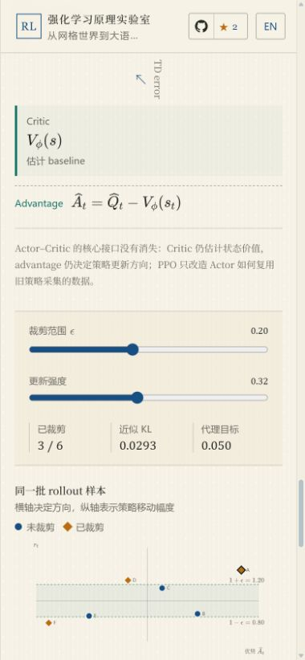
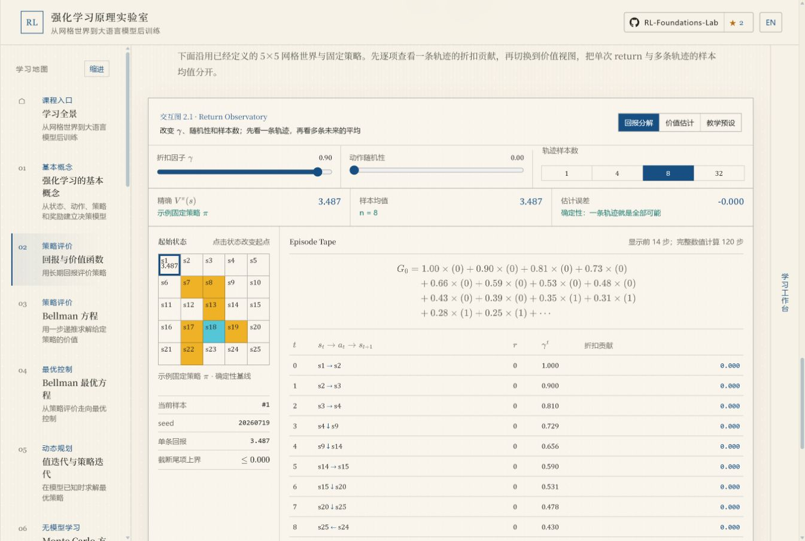

# RL Foundations Lab 完整 Review

日期：2026-07-24  
范围：全站 21 章中文正文、正文组织、数学衔接、交互实验、桌面端与移动端代表性页面  
性质：只读审查；本轮未修改产品代码

## 一、结论摘要

当前版本已经越过了“页面排版失控”的阶段，但还没有达到可以按统一标准发布的状态。

最明确的判断有四点：

1. **机械格式已基本稳定。** 正文没有手写 ` `，主阅读路径使用统一行高和间距，中文启用了短语感知折行。当前继续影响阅读的主要因素已经从 CSS 换行转为段落语义、中文表达和公式衔接。
2. **内容组织前半程明显强于后半程。** 第 1–9 章整体因果链较完整，第 7 章最适合作为结构样板；第 10–21 章出现更多推导后重复启动、术语提前出现、英文工程表达直译和章末缺少下一问题等现象。
3. **交互设计不能一概而论。** 第 3、4、7、14、18、19 章已经使用本章专属数学对象和内部证据，不应推倒重做；第 6、9、11、20、21 章则存在概念契约、反事实真实性或内部状态不足的问题。
4. **目前有两项教学正确性 P0。** Monte Carlo 实验把 continuing 环境中的固定长度截断称作“完整 episode”；Sarsa/Q-learning 所谓“只改变 target”的对照实际上读取了两张不同 Q 表。这两项会直接造成错误理解，应先于语言润色修复。

## 二、审查方法

本次由三个独立视角并行审查，并由主审交叉验证：

- **格式与语言：** 标题密度、段落边界、中文语法、术语一致性、公式前后文和移动端拆词。
- **内容组织：** 未解决问题、因果主线、概念首现、推导动机、running example、实验衔接、总结和下一章 handoff。
- **交互真实性：** 数学对象、算法内部状态、更新顺序、数据流、固定证据下的反事实、移动端与可访问性。

内容组织采用六个独立维度评分，不把它们合并成模糊的“整体质量”：

1. 概念顺序；
2. 因果连续；
3. 数学整合；
4. 例子连续；
5. 实验衔接；
6. 视觉层级。

## 三、P0：必须先修的教学风险

### P0-1：Monte Carlo 的 episode 契约错误

界面声明三种 Monte Carlo 方法从共享 5×5 网格中“采集完整 episode”，但该网格被定义为 continuing、没有终止状态。引擎只运行固定 `horizon=24`，随后从尾部零值反向累计 return，没有终止判断，也没有截断后的 bootstrap。

证据：

- `src/components/MonteCarloLab.jsx:60`
- `src/components/CourseWorldExplorer.jsx:89`
- `src/components/CourseWorldExplorer.jsx:117`
- `src/engine/learning-labs.js:77-83`
- `src/engine/learning-labs.js:109`
- `src/engine/learning-labs.js:119-121`

修复方向二选一：

- 为 Monte Carlo 建立真正 episodic 的课程环境和 terminal；
- 保留 continuing 网格，但明确改为 truncated rollout，并显示 truncation mask、尾部 bootstrap 和截断偏差。

### P0-2：Sarsa/Q-learning 不是严格受控反事实

界面声称使用“同一条经验”，差异“只来自更新目标”。但 Sarsa target 读取 Sarsa 独立训练后的 Q 表，Q-learning target 读取另一张独立训练后的 Q 表。因此结果同时受后继动作规则和两套已分化估计影响。

证据：

- `src/components/LearningLab.jsx:154`
- `src/components/LearningLab.jsx:164-169`
- `src/engine/learning-labs.js:355`
- `src/engine/learning-labs.js:363-364`

修复方向：

- 固定同一个 `(S_t,A_t,R_{t+1},S_{t+1})`；
- 固定同一张 `Q_snapshot`；
- Sarsa 只读取实际抽到的 `A_{t+1}`；
- Q-learning 只把后继项换成同一 Q 行的 `argmax_a`；
- 将长期独立训练后的两张策略图放在第二层，解释局部差异如何累积成长期结果。

### P0-3：source coverage 存在，但不可逐项审计

现有测试验证章节长度、特定 ID、推导数量和少数公式；它不是完整的 `source item → reader-visible destination` 矩阵。当前无法证明每个算法变体、假设、收敛含义、完整伪代码和 worked example 都有明确去处。

修复方向：

- 为 21 章建立显式 source-coverage matrix；
- 每一项标记 required / optional / out-of-scope；
- required 项必须映射到 prose、derivation、pseudocode、example 或 experiment；
- 公式存在本身不算算法覆盖。

## 四、P1：跨章结构性问题

### 1. 标题存在两个事实来源

`src/content.js:207-220` 会用导航标题覆盖章节源标题，并用 `visibleSectionTitles` 再覆盖 article-flow 标题。当前界面显示正常，但章节源文件仍保留 19 个旧式问句标题，后续维护者可能修改“看似生效、实际被覆盖”的内容。

建议把最终标题迁回章节文件，删除集中覆盖表。

### 2. 段落合并仍是机械规则

`type === 'turn'` 默认被无条件拼成一个段落，解决了错误换行，却没有自动补出因果连接。全站仍有约 30 个一至两句的短 turn，第 4、10、21 章最集中。

建议逐段决定：

- 同一推理任务：合并并补因果连接；
- 新的数学对象或论证阶段：保留真实段落；
- 内容不足：扩写或删除，不用 CSS 假装连续。

### 3. 术语缺少统一首次定义

高频摇摆包括：

- `return / 回报`
- `state value / 状态价值 / value`
- `target / 目标值`
- `backup / 更新`
- `fixed point / 不动点`
- `trajectory / 轨迹`
- `reference / 参考模型`
- `value model / 价值模型`
- `episode / 回合`

建议普通概念首次写“中文名（英文）”，后文固定使用中文；算法专名和界面短标签可以保留英文。

### 4. 公式经常只有“前文”，没有“后用”

约 25 个正文 turn 通过通用 `formula/formulas` 字段把公式追加到段尾。部分公式有前置动机，却缺少紧随其后的解释或使用，下一块已经开始新任务。

建议每个 display equation 都具备：

- `before`：为什么现在需要它；
- `role`：定义、前提、变换、结论、条件或代入；
- `after`：它得到什么结论，下一步怎样使用。

### 5. 推导完成后重新启动

第 4、10、11、12、13、16 章较明显：

- DQN 的 `two-instabilities` 与 `moving-target` 重复诊断；
- Policy Gradient 在完整推导后又从 log trick 和 baseline 重讲；
- Actor–Critic 在 advantage 和双更新完成后再次复述同一链；
- RLHF 在推导已使用五类模型后又逐个重讲来源。

深化部分应从推导留下的具体限制开始，只补新信息。

### 6. 后半程中文更像工程汇报

第 12–21 章明显增加英文名词串和名词化表达，例如：

- “softmax 在动作之间守恒概率质量”
- “五种数据血缘”
- “免 Critic 的相对 baseline”
- “从 table 到 function”
- “动作信用来自它相对合理替代的边际价值”

应改写为有主体、动作和结果的中文技术叙述。

## 五、交互实验审查

### 交互设计的通过标准

一个合格的交互实验不只是“能调参数”，而应同时回答：

1. 当前操纵的真实数学对象是什么；
2. 哪些内部状态正在变化；
3. 更新按什么顺序发生；
4. 证据从哪里来、流向哪里；
5. 反事实是否只改变一个声明的变量；
6. 实验结果怎样回到正文提出的命题。

### 已经很强、应作为样板的实验

- 第 3 章 Bellman：单步 target、分支贡献、before/after、residual、step/undo/play。
- 第 4 章最优性：同一 value snapshot 上切换策略加权与动作最大化。
- 第 7 章随机逼近：两条估计轨迹读取同一观测流，并显示单步账本和历史权重。
- 第 14 章 PPO：同一批样本、clip band、样本 inspector 和裁剪前后目标。
- 第 18 章 GRPO：同一 prompt group 内奖励、标准化 advantage、ratio、clip 和零方差警告。
- 第 19 章 Coding RL：补丁 diff、可见/隐藏测试和不同奖励契约，已经明显超越正文复述。

### 需要重点重构的实验

#### 第 11 章 DQN

已经有 replay buffer、online/target 参数和同步条，但缺少完整的：

`sampled transition → target → TD error → gradient → online update → periodic target sync`

同步时钟目前是静态装饰，buffer 抽样也可能因重复 ID 错标 transition。

#### 第 15 章 Token MDP

界面提到 EOS 与长度截断，但所有 token mask 固定为 1，return 从 `future=0` 开始，没有 `V(s_{T+1})` 或 bootstrap 开关。截断语义目前只是文字说明，没有进入计算。

#### 第 20 章 Agent MDP

界面标题称为 trajectory tree，但引擎只是截断预制线性步骤。错误定位没有替代动作、替代 observation 和下游状态，读者看到的是“带分支说明的列表”，不是真正的策略分支。

#### 第 21 章信用分配

当前四种方案本质是把预设数组混入 return；process/hindsight 信号不来自 verifier、动作替换重放或独立验证。应加入工具级 segment credit 和 leave-one-decision-out replay。

### 可访问性风险

- PPO SVG 样本点使用 `role="button"` 和鼠标点击，却没有 `tabIndex` 与键盘事件：`src/components/PpoLab.jsx:26-29`。
- Return 图中的可点击 `<g>` 缺少 button role：`src/components/ReturnObservatory.jsx:44`。
- 多数 segmented controls 只有视觉 active，缺少 `aria-pressed`。
- Actor–Critic 移动端单列样式疑似漏项：`src/styles.css:1411-1412`。

移动端 PPO 能重排到 342 px 主列且没有页面级横向溢出，但截图无法证明键盘和辅助技术可用性。

## 六、页面取证步骤

| 步骤 | 页面状态 | 健康度 | 结论 |
|---|---|---|---|
| 1 | 第 2 章 Return Observatory | 良好 | 网格、episode tape、折扣贡献和样本均值共享同一轨迹，正文与实验衔接自然。 |
| 2 | 第 6 章 Monte Carlo Lab | 不通过 | 视觉对象专属，但“完整 episode”与 continuing 环境/固定 horizon 的实现冲突。 |
| 3 | 第 7 章随机逼近显微镜 | 优秀 | 同一证据流、更新账本、历史权重和受控反事实完整，是全站实验基准。 |
| 4 | 第 11 章 DQN System Lab | 需重构 | replay/target 对象正确，但缺少逐更新数据流，同步时钟不真实。 |
| 5 | 第 14 章 PPO 桌面实验 | 良好 | 固定 batch 上的裁剪反事实成立；需补梯度是否归零和键盘选择。 |
| 6 | 第 19 章 Coding RL | 良好 | 隐藏测试和奖励投机展示很强；仍缺“观察错误后继续修复”的下一状态。 |
| 7 | 第 20 章 Agent Trajectory Tree | 不通过 | 可见结果是线性轨迹，不是真正分支树。 |
| 8 | 第 14 章 PPO 移动端 | 基本良好 | 主交互可重排、无页面级横向溢出；可访问性仍需键盘与读屏测试。 |

## 七、21 章综合评分

说明：

- 语言为 10 分制；
- 组织为六维平均，5 分制；
- 交互真实性为 10 分制；
- 组织六维明细见下一节。

| 章 | 语言 | 组织 | 交互 | 判定 | 当前最关键问题 |
|---|---:|---:|---:|---|---|
| 01 强化学习基本概念 | 8.5 | 4.7 | 8.5 | 良好 | 定义标题偏密，状态充分性反例略重复。 |
| 02 回报与价值函数 | 7.3 | 4.8 | 8.5 | 良好 | 中英文术语摇摆；推导入口与实验入口轻微重复。 |
| 03 Bellman 方程 | 7.4 | 4.5 | 9.0 | 良好 | 四状态手算链突然离开共享网格，需说明用途并映射回来。 |
| 04 Bellman 最优方程 | 8.0 | 4.7 | 9.0 | 良好 | 推导结束后仍有多个结论性重复块。 |
| 05 值迭代与策略迭代 | 7.2 | 4.8 | 8.5 | 良好 | 在预算矛盾出现前过早列出 VI/TPI/PI 分类。 |
| 06 Monte Carlo 方法 | 7.5 | 4.8 | 5.5 | P0 | “完整 episode”与 continuing 实现冲突。 |
| 07 随机逼近与 SGD | 8.5 | 4.5 | 9.5 | 样板 | running example 需更明确标出观测来自哪个网格 `(s,a)`。 |
| 08 时间差分学习 | 8.1 | 4.8 | 7.0 | 良好 | `V(S_n)` 是人工构造，未真正连接轨迹与 value table。 |
| 09 Sarsa 与 Q-learning | 7.6 | 4.7 | 5.0 | P0 | 同一经验反事实读取两张不同 Q 表。 |
| 10 价值函数近似 | 6.5 | 4.7 | 7.5 | P1 | 参数共享被重复解释；中文英文腔明显。 |
| 11 Deep Q-learning | 7.0 | 4.0 | 6.0 | P1 | 两次启动相同不稳定性；交互缺逐更新数据流。 |
| 12 策略梯度方法 | 6.3 | 4.7 | 6.5 | P1 | 完整推导后再次重走 log trick/baseline；策略模型过度简化。 |
| 13 Actor–Critic | 6.2 | 4.7 | 7.0 | P1 | 中英混排最重；深化部分重复 advantage 与双更新。 |
| 14 PPO | 6.4 | 4.7 | 8.5 | 良好 | 语言工程化；章末没有自然逼出 token MDP；SVG 键盘缺失。 |
| 15 语言模型的 MDP 表示 | 6.0 | 4.8 | 7.5 | P1 | future terms 提前出现；截断 mask/bootstrap 没有真正实现。 |
| 16 基于 PPO 的 RLHF | 5.9 | 4.7 | 7.0 | P1 | 五类模型重复启动；SFT 未展开；中文像系统汇报。 |
| 17 DPO | 6.5 | 4.7 | 8.0 | P1 | β 的完整含义放在实验后；slider 没有展示优化步骤。 |
| 18 GRPO | 5.9 | 4.3 | 8.5 | P1 | DAPO 先于零方差失败出现；术语密度过高。 |
| 19 Coding RL | 6.4 | 4.0 | 9.0 | P1 | 正文要求 repair trajectory，实验仍是三个静态补丁。 |
| 20 工具型 Agent 的 MDP | 6.0 | 4.0 | 5.5 | P1 | 部分可观测性顺序偏早；所谓 trajectory tree 只是线性列表。 |
| 21 长程 Agent 信用分配 | 6.3 | 4.3 | 6.0 | P1 | 推导仍碎；实验缺 segment credit 与真实反事实重放。 |

## 八、内容组织六维评分

| 章 | 概念顺序 | 因果连续 | 数学整合 | 例子连续 | 实验衔接 | 视觉层级 |
|---|---:|---:|---:|---:|---:|---:|
| 01 | 5 | 5 | 4 | 5 | 5 | 4 |
| 02 | 5 | 5 | 5 | 5 | 5 | 4 |
| 03 | 5 | 4 | 5 | 4 | 5 | 4 |
| 04 | 5 | 4 | 5 | 5 | 5 | 4 |
| 05 | 5 | 5 | 5 | 5 | 5 | 4 |
| 06 | 5 | 5 | 5 | 5 | 5 | 4 |
| 07 | 5 | 5 | 5 | 3 | 5 | 4 |
| 08 | 5 | 5 | 5 | 5 | 5 | 4 |
| 09 | 5 | 5 | 5 | 4 | 5 | 4 |
| 10 | 5 | 4 | 5 | 5 | 5 | 4 |
| 11 | 4 | 3 | 5 | 4 | 5 | 4 |
| 12 | 5 | 4 | 5 | 5 | 5 | 4 |
| 13 | 5 | 4 | 5 | 5 | 5 | 4 |
| 14 | 5 | 5 | 5 | 4 | 5 | 4 |
| 15 | 5 | 5 | 5 | 5 | 5 | 4 |
| 16 | 5 | 4 | 5 | 5 | 5 | 4 |
| 17 | 5 | 4 | 5 | 5 | 5 | 4 |
| 18 | 4 | 3 | 5 | 5 | 5 | 4 |
| 19 | 5 | 4 | 5 | 3 | 3 | 4 |
| 20 | 4 | 3 | 5 | 5 | 3 | 4 |
| 21 | 5 | 4 | 5 | 5 | 3 | 4 |

## 九、建议的修复顺序

### Phase 0：建立可审计内容基础

1. 建立 21 章 source-coverage matrix。
2. 消除标题双重来源。
3. 建立全站中文术语表和首现规则。
4. 将通用 formula 字段升级为 `before / role / after` 契约。
5. 对 30 个短 turn 做逐段语义审查。

### Phase 1：先修教学正确性和虚假反事实

1. 第 6 章 Monte Carlo 终止/截断契约。
2. 第 9 章 Sarsa/Q-learning 同 Q snapshot 对照。
3. 第 15 章 Token MDP 的 terminated/truncated、mask 与 bootstrap。
4. 第 20 章真实 transition tree。
5. 第 21 章 segment credit 与 counterfactual replay。

### Phase 2：重写后半程中文与组织

优先顺序：

1. 第 16、18、20、21 章；
2. 第 12、13、14、15、17、19 章；
3. 第 10、11 章。

每章按第 7 章标准重写：

`具体未解决问题 → 失败或不足 → 必需机制 → 推导 → worked consequence → 实验 → 解释 → 下一限制`

### Phase 3：升级中等质量交互

1. DQN：逐步 replay clock 和完整更新账本。
2. TD：真实 value table 上的 n-step bootstrap。
3. Policy Gradient：状态条件策略、逐步梯度贡献和多轨迹方差。
4. Actor–Critic：Actor logits/probability 与 Critic value 同步 before/after。
5. RLHF：一条 batch 的 provenance、shape、mask 和模型版本流。
6. DPO：梯度贡献与一步 optimizer 更新。

### Phase 4：补齐可访问性和回归测试

1. 所有视觉 active 控件补 `aria-pressed`。
2. SVG 可点击点补键盘焦点与 Enter/Space。
3. Return 图形元素补语义 role 和可访问名称。
4. 增加反事实不变量测试，而不只检查组件和标签存在。
5. 增加桌面/移动端键盘、隐藏视图和交互 E2E。

## 十、证据限制

- 本轮截图可以验证可见层级、默认状态、响应式重排和部分交互反馈，但不能单独证明完整 WCAG 合规。
- source coverage 只能确认当前已有内容和测试，无法替代尚未建立的逐项来源矩阵。
- 视觉层级评分结合了代表性桌面/移动截图与组件结构；不是 21 章每个滚动位置的逐像素审美评分。
- 本报告没有修改代码，所有建议仍需按章节实施后重新运行内容契约、数学渲染、桌面/移动 QA 和交互真实性测试。
